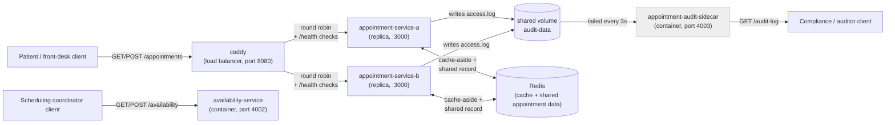

# Initial Service List

This is a first guess at the services our simulation will include (team size
2, so 3 custom services). This list will change as we learn more patterns in
later weeks - Sprint 2 begins with 2 of these, and Sprint 4 adds at least one
more.

- **appointment-service**: Handles creation, rescheduling, and cancellation
  of individual patient appointments, and enforces conflict checks against
  the requested provider and time slot.
- **availability-service**: Maintains the current set of open, booked, and
  blocked time slots per provider and facility, and processes updates when
  slots are reserved, released, or blocked by staff.
- **scheduling-gateway**: The shared entry point that receives patient
  scheduling requests, routes them to the appropriate facility's
  availability-service, and reconciles the outcome with
  appointment-service before responding.
- **prescription-service**: Manages prescription for each personal patient. Accepts query requests from provider/facility
- **prescribe-service**: Routes query requests for prescription (create, update, delete) from provider/facility to appropriate patients

## System diagram (updated through Sprint 3)

Sprint 2 built the first two services (`appointment-service` and
`availability-service`) plus a sidecar. `scheduling-gateway` is still not
built (targeted for Sprint 4).

`appointment-audit-sidecar` is a classic sidecar: it never sits in the
request path between a client and `appointment-service`. It only tails the
access log that `appointment-service` writes to their shared volume, and
`appointment-service` has no idea it exists. This is the healthcare
audit-trail requirement from `docs/PROJECT.md` — a record of who booked,
read, or cancelled what, kept separate from the booking logic itself.

Sprint 3 replicates `appointment-service` behind Caddy and adds Redis.
Redis is doing two distinct jobs here, not one: it's the cache that makes
a repeated `GET /appointments/:id` fast, but it's also the *shared*
appointment record both replicas read and write — without that second
role, a cancel handled by one replica would be invisible to the other
once its cached copy expired.

`appointment-service` and `availability-service` do not talk to each other
yet — that coordination is `scheduling-gateway`'s job, added in Sprint 4.
